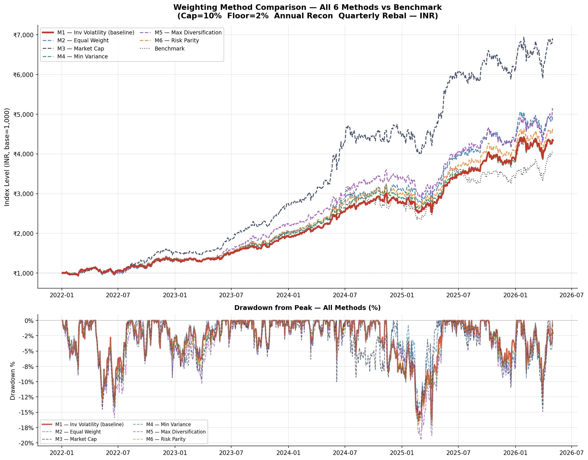
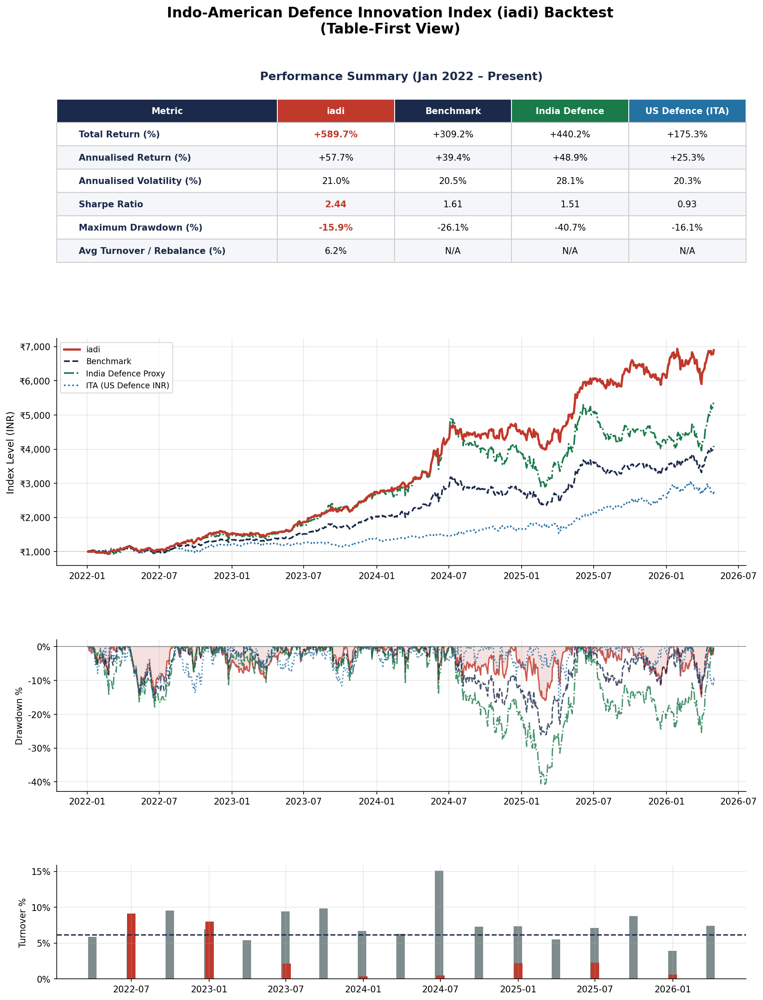
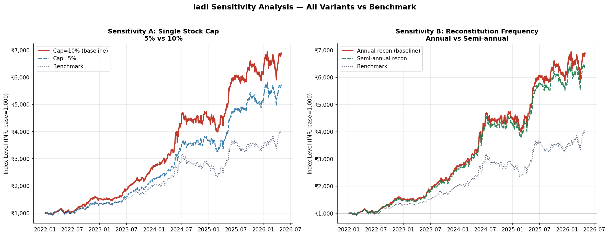

# 🛡️ IADI — Indo-American Defence Innovation Index

**A rules-based, backtested thematic index tracking US & Indian defence innovation companies**

> Backtest Period: January 2022 – April 2026 | Base Value: ₹1,000 | Denominated in INR

---

## 📌 Table of Contents

- [Project Overview](#-project-overview)
- [Investment Thesis](#-investment-thesis)
- [Repository Structure](#-repository-structure)
- [Index Methodology](#-index-methodology)
  - [Eligibility Criteria](#eligibility-criteria)
  - [Liquidity Filters](#liquidity-filters)
  - [Constituent Selection (Stage A)](#constituent-selection-stage-a--min-vol-optimiser)
  - [Weighting Methodology (Stage B)](#weighting-methodology-stage-b--market-cap-weights)
  - [Rebalancing & Reconstitution Schedule](#rebalancing--reconstitution-schedule)
- [Data Sources](#-data-sources)
- [Pipeline Architecture](#-pipeline-architecture)
- [Performance Results](#-performance-results)
  - [Key Metrics Table](#key-metrics-table)
  - [Year-by-Year Returns](#year-by-year-returns)
  - [Latest Portfolio Holdings](#latest-portfolio-holdings-march-2026)
- [Methodology Evolution (v1.0 → v1.1)](#-methodology-evolution-v10--v11)
- [Key Design Decisions](#-key-design-decisions)
- [Limitations & Caveats](#-limitations--caveats)
- [How to Run](#-how-to-run)
- [Dependencies](#-dependencies)

---

## 📖 Project Overview

IADI (Indo-American Defence Innovation Index) is a systematic, rules-based thematic index designed to track publicly listed companies in the **United States and India** that derive a meaningful share of their revenue from:

- **Defence manufacturing & platforms** (aerospace, naval, munitions)
- **AI & autonomous systems** (drone swarms, autonomous ground/air vehicles)
- **Cybersecurity & electronic warfare** (radar, EW systems, cyber-defence IT)

The index is denominated in **INR** and is designed as the underlying index for a potential India-listed ETF. It fills a real product gap: no existing ETF covers both the US and Indian defence sectors simultaneously.

---

## 💡 Investment Thesis

Three structural macro trends underpin the index:

1. **Geopolitical realignment** — Record defence budgets globally post-2022. India is targeting self-reliance under *Aatmanirbhar Bharat* while the US sustains multi-theatre deterrence spending.

2. **AI in warfare** — Autonomous systems, drone swarms, and AI-enabled command-and-control are reshaping procurement priorities across both nations.

3. **Product gap** — Existing defence ETFs (ITA, XAR, DFEN) are US-only. No bilateral US–India defence index exists. IADI fills this white space with a risk-optimised, rules-based approach.

---

## 📁 Repository Structure

```
iadi-etf-index/
│
├── ETF_Portfolio_project.ipynb     # Main Jupyter Notebook — full pipeline & backtest
├── IADI_Rulebook_v1.1.pdf          # Formal index methodology rulebook (v1.1)
├── IADI_Decision_Log.pdf           # Record of all design decisions & tradeoffs
└── README.md                       
```

---

## 📐 Index Methodology

### Eligibility Criteria

| Criterion | Rule |
|---|---|
| Exchange Listing | NYSE, NASDAQ (US) or NSE, BSE (India) |
| Sub-theme | ≥1 of: AI & Autonomous Systems, Defence Manufacturing & Platforms, Cybersecurity & Electronic Warfare |
| Revenue Exposure | ≥33% of trailing 12-month revenue from defence/aerospace contracts |
| Market Cap | US: Free-float market cap ≥ USD 500M · India: Free-float market cap ≥ ₹1,000 Cr |
| Share Class | Primary listings only — ADRs and GDRs excluded |
| Currency | INR throughout. US constituents converted at daily USD/INR close rate |

**Manual Overrides:** A small set of force-includes and force-excludes was applied to handle failure modes in the keyword filter. Force-includes cover well-known defence pure-plays whose `yfinance` descriptions are too sparse to trigger keyword matching (e.g., Palantir, Leidos, Booz Allen Hamilton). Force-excludes remove companies whose primary revenue is non-defence (e.g., Fortinet, CrowdStrike, Bharat Forge).

### Liquidity Filters

Computed over a **63-trading-day (≈3-month) ADTV** window prior to each reconstitution:

- **US stocks:** ADTV ≥ USD 10 million
- **India stocks:** ADTV ≥ ₹15 Crore (INR 150M)

A **20% buffer rule** applies for existing constituents — they only get removed if they fall below 80% of the ADTV threshold. This reduces unnecessary churn and transaction costs.

### Constituent Selection (Stage A) — Min-Vol Optimiser

After eligibility and liquidity filtering, constituents are selected by solving a **Mean-Variance Minimum Volatility QP**:

```
min  w' Σ w
s.t. Σwᵢ = 1
     0.02 ≤ wᵢ ≤ 0.10
     No leverage, no shorts
```

- Covariance matrix computed on a **126-day rolling window** (~6 months) using trading-day intersection to avoid holiday-driven NaN bias
- Ridge regularisation applied: **λ = 1×10⁻⁶**
- Solver: `scipy.optimize.minimize` with `SLSQP` and analytic gradient
- Fallback: Market-cap weights if SLSQP fails to converge
- Expected constituent range: **20–40 stocks**

### Weighting Methodology (Stage B) — Market Cap Weights

```
wᵢ = mcapᵢ / Σ mcapⱼ
```

Applied iteratively with cap (10%) and floor (2%) until constraints are satisfied. This methodology was selected after a systematic **6-method comparison** over the full backtest period:

| Method | Sharpe Ratio |
|---|---|
| 🥇 Market Cap | 2.44 |
| 🥈 Minimum Variance | ~2.1 |
| 🥉 Risk Parity | ~1.9 |
| Inverse Volatility | ~1.8 |
| Equal Weight | ~1.7 |
| Maximum Diversification | ~1.6 |




Market Cap weighting was also the most transparent and operationally simple — important for an index that needs to be independently replicable.

### Rebalancing & Reconstitution Schedule

| Event | Frequency | Months |
|---|---|---|
| Reconstitution (re-run all filters + min-vol selection) | Semi-annual | January, July |
| Rebalancing (refresh weights only, same constituents) | Quarterly | March, June, September, December |

Between rebalance dates, weights drift naturally with price movements.

---

## 📊 Data Sources

| Data Type | Source | Notes |
|---|---|---|
| Daily price & volume (US + India) | `yfinance` (Yahoo Finance) | Adjusted close prices |
| USD/INR exchange rate | `yfinance` (ticker: `USDINR=X`) | Forward-filled up to 5 days for missing values |
| Market cap | `yfinance` `.info` | Used for weighting and eligibility screening |
| India universe seed list | NSE `EQUITY_L.csv` + keyword matching | Filtered by defence-related keywords |
| Benchmark — India leg | Nifty India Defence Index (reconstructed) | Manually rebuilt from NSE factsheets + ETF disclosures using semi-annual constituent snapshots |
| Benchmark — US leg | iShares ITA ETF (`ITA`) | Converted to INR for comparison |

**Note on benchmark construction:** The Nifty India Defence Index historical data is not available through any free source. The India benchmark leg was reconstructed manually using semi-annual NSE factsheet snapshots and historical ETF disclosures. The 6-month average price was used as a proxy for free-float market cap. This is an acknowledged approximation.

---

## ⚙️ Pipeline Architecture

The notebook is structured as numbered blocks for clarity and reproducibility:

```
BLOCK 01 — Config & Parameters
BLOCK 02 — Universe Construction (NSE + curated US list)
BLOCK 03 — yfinance Validation + Revenue Keyword Filter + Manual Overrides
BLOCK 04 — Data Ingestion (IADI universe + Nifty Defence proxy)
BLOCK 05 — INR Currency Conversion (US stocks × USDINR rate)
BLOCK 06 — ADTV Liquidity Filter
BLOCK 07 — Min-Vol Optimiser + Inverse-Vol / Market Cap Weighting
BLOCK 08 — Index Construction Engine (full backtest loop)
BLOCK 09 — Benchmark Construction (ITA + reconstructed Nifty Defence)
BLOCK 10 — Performance Analytics (6 metrics + year-by-year)
BLOCK 11 — Visualisations (index vs benchmark, drawdown chart)
BLOCK 12 — Sensitivity Analysis (weight cap, floor, lookback)
BLOCK 13 — 6-Method Weighting Comparison
```

All key parameters are centralised in a single `CONFIG` dictionary at the top of Block 01, making the pipeline easy to reproduce and re-run with different settings.

---

## 📈 Performance Results

### Key Metrics Table

| Metric | IADI | Benchmark (50% ITA + 50% Nifty India Defence) |
|---|---|---|
| **Total Return (%)** | **589.13%** | 309.20% |
| **Annualised Return (%)** | **57.76%** | 39.48% |
| **Annualised Volatility (%)** | 20.97% | 20.48% |
| **Sharpe Ratio** | **2.445** | 1.610 |
| **Max Drawdown (%)** | **-15.95%** | -26.09% |
| **Avg Turnover / Rebal (%)** | **6.15%** | N/A |




> Risk-free rate: 6.5% p.a. (Indian 10-yr G-Sec, INR)  
> Gross returns — transaction costs not deducted (standard index methodology practice)

IADI delivered **nearly double the Sharpe ratio** of the benchmark, with a shallower maximum drawdown despite comparable volatility. The low average quarterly turnover of **6.15%** confirms the index is efficient and implementable.

### Year-by-Year Returns

| Year | IADI | Benchmark |
|---|---|---|
| 2022* | — | — |
| 2023 | +78.1% | +50.9% |
| 2024 | +63.6% | +37.0% |
| 2025 | +36.2% | +23.1% |
| 2026 (YTD) | +13.1% | +20.1% |

> \* 2022 is the index base year (₹1,000 starting value). Full-year 2022 return is embedded in the total return but excluded here as the index launched mid-year.

### Latest Portfolio Holdings (March 2026)

- **Total stocks:** 34
- **US allocation:** 46.6%
- **India allocation:** 53.4%

Top holdings by weight: HAL.NS (9.02%), BEL.NS (9.02%), SOLARINDS.NS (9.02%), MAZDOCK.NS (8.45%), followed by major US defence names (Palantir, RTX, LMT, NOC, GD).

---

## 🔄 Methodology Evolution (v1.0 → v1.1)

All changes were determined by systematic empirical analysis over the full backtest period:

| Parameter | v1.0 | v1.1 |
|---|---|---|
| Weighting Method | Inverse Volatility (126-day σ) | Market Cap (free-float), capped at 10% |
| Single Stock Cap | 5% | 10% |
| Single Stock Floor | 2% | 2% (unchanged) |
| Reconstitution | Annual (January only) | Semi-annual (January + July) |
| Weight Rebalance | Quarterly | Quarterly (unchanged) | 




**Key insight:** In the Indian defence re-rating of 2022–2024, size was the dominant signal. Larger names (HAL, BEL, Mazagon Dock) drove the bulk of sector returns. Inverse volatility overweighted smaller, lower-vol names that underperformed during this period.

---

## 🧠 Key Design Decisions

All 15 design decisions are documented in full in `IADI_Decision_Log.pdf`. Highlights:

- **Revenue threshold (33%):** Tested at 20% (too wide) and 40% (too narrow). One-third rule kept the stock count in the target range while being financially meaningful.
- **Dynamic constituent count:** Shifted from a fixed target to a filter-determined count. More realistic and avoids forcing inclusions to hit an arbitrary number.
- **No transaction costs:** Excluded deliberately because US and Indian markets have fundamentally different cost structures (STT, SEBI charges, bid-ask spreads) with no free normalisation reference. Turnover is disclosed at every rebalance event so costs can be estimated independently.
- **Geography split:** Rather than enforcing a hard 60/40 US/India split, the eligibility filters and market cap weighting determined it organically. The result (≈47/53 as of 2026) aligned closely with the original intuition.
- **Benchmark India leg:** No free historical data exists for Nifty India Defence. The index was reconstructed manually from NSE factsheets to avoid either dropping the India comparison entirely or substituting the irrelevant Nifty 50.

---

## ⚠️ Limitations & Caveats

- **Gross returns only** — no transaction costs, STT, SEBI charges, brokerage, or slippage
- **Survivorship bias** — the universe was constructed with current knowledge; some companies may not have been identifiable as defence pure-plays in 2022
- **Benchmark approximation** — the India leg of the benchmark is manually reconstructed and uses a 6-month average price as a proxy for free-float market cap
- **FX risk** — Indian investors in IADI bear full USD/INR FX risk on the US allocation; no hedging is applied
- **yfinance data quality** — adjusted prices and market cap figures from Yahoo Finance can occasionally have gaps or inconsistencies, handled via forward-filling and median imputation
- **Scope** — only US and Indian markets are covered; a truly global defence index would include UK, France, Israel, and South Korea

---

## 🚀 How to Run

1. Clone the repository:
   ```bash
   git clone https://github.com/aguru-venkata-saisantosh-patnaik/IADI_ETF_Design_and_Backtest.git
   cd IADI_ETF_Design_and_Backtest
   ```

2. Install dependencies:
   ```bash
   pip install -r requirements.txt
   ```

3. Open the notebook:
   ```bash
   jupyter notebook ETF_Portfolio_project.ipynb
   ```

4. Run all cells from top to bottom. The pipeline is self-contained — all data is fetched live from `yfinance` at runtime.

> **Note:** A live internet connection is required for data download. Full execution takes approximately 5–10 minutes depending on connection speed.

---

## 📦 Dependencies

```
pandas
numpy
scipy
yfinance
matplotlib
seaborn
jupyter
```

All data is pulled at runtime from Yahoo Finance using the `yfinance` library. No proprietary or paid data sources are required.

---

## 📄 Documents

| Document | Description |
|---|---|
| `IADI_Rulebook_v1.1.pdf` | Formal methodology rulebook — defines all index rules, eligibility, weighting, and schedule |
| `IADI_Decision_Log.pdf` | Decision log — 15 entries covering what was tried, what was rejected, and why |

---


*Built with a focus on financial rigour, clean engineering, and transparent decision-making.*
